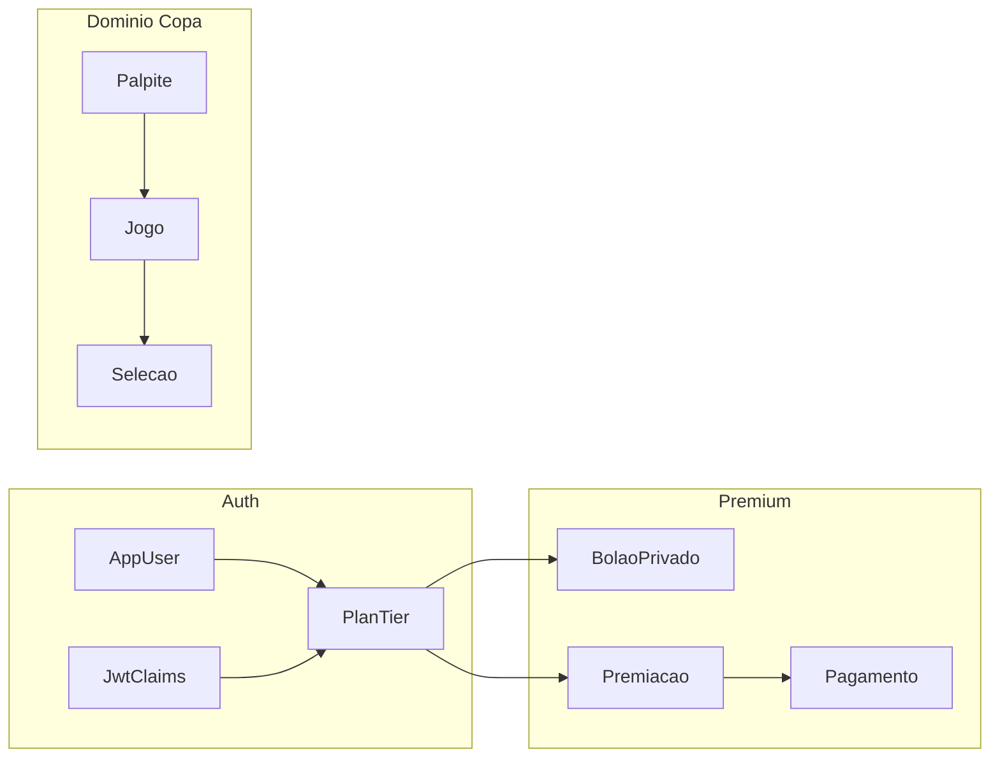

# Plano: palpite editável, admin, planos Bronze/Prata/Ouro

## Escopo em uma frase

Entregar regras de negócio e APIs consistentes entre [copa/](d:\Documents\cursor\copa\copa) (Spring Boot) e [bolao_copa_web/](d:\Documents\cursor\copa\bolao_copa_web) (Flutter Web), cobrindo edição de palpite, painel/admin REST para domínio da Copa, e um modelo de **plano de assinatura** separado de **papel de segurança** (`ROLE_USER` / `ROLE_ADMIN`), evoluindo para bolão privado (Prata) e premiação (Ouro).

## Decisão fixada: pagamento

- **Fase comercial 1:** modelo de dados de assinatura + **liberação manual** (admin) ou fluxo **PIX/comprovante → aprovação** — sem gateway obrigatório.
- **Fase comercial 2:** integração com gateway (ex.: Mercado Pago) + webhooks e renovação. O plano técnico abaixo deixa interfaces e tabelas preparadas para isso.

## Estado atual (as-is)

| Área | Situação |
|------|----------|
| Palpite | [PalpiteService](d:\Documents\cursor\copa\copa\src\main\java\com\bolao\copa\bolao\PalpiteService.java) bloqueia criação após `kickoffAt`; não existe update. [PalpiteController](d:\Documents\cursor\copa\copa\src\main\java\com\bolao\copa\bolao\PalpiteController.java) só `POST` e `GET /me`. |
| Flutter | [jogo_detail_screen.dart](d:\Documents\cursor\copa\bolao_copa_web\lib\features\jogos\presentation\jogo_detail_screen.dart) só chama `createPalpite`; [bolao_api.dart](d:\Documents\cursor\copa\bolao_copa_web\lib\core\api\bolao_api.dart) sem `PATCH`. |
| Admin | [JogoController](d:\Documents\cursor\copa\copa\src\main\java\com\bolao\copa\bolao\JogoController.java): `POST` e `PATCH .../resultado-oficial` com `hasRole('ADMIN')`. [SelecaoController](d:\Documents\cursor\copa\copa\src\main\java\com\bolao\copa\bolao\SelecaoController.java): só `POST` admin. Não há `PUT/PATCH/DELETE` para edição completa nem UI admin no Flutter. |
| Usuário | [AppUser](d:\Documents\cursor\copa\copa\src\main\java\com\bolao\copa\auth\user\AppUser.java): campo único `roles` (ex.: `ROLE_USER`); registro em [AuthService](d:\Documents\cursor\copa\copa\src\main\java\com\bolao\copa\auth\AuthService.java) com `DEFAULT_ROLE`. JWT em [JwtService](d:\Documents\cursor\copa\copa\src\main\java\com\bolao\copa\auth\security\JwtService.java) inclui claim `roles`, não há tier. |
| Ranking | [MvRankingUsuario](d:\Documents\cursor\copa\copa\src\main\java\com\bolao\copa\ranking\MvRankingUsuario.java) é **global**; bolão privado exigirá novo modelo ou visão agregada. |

## Arquitetura alvo (visão)

**Suposições explícitas (máx. 3):**

- Plano comercial (**Bronze / Prata / Ouro**) fica em coluna ou tabela dedicada, **ortogonal** a `ROLE_ADMIN`.
- Bolão privado: palpites do usuário podem participar do **global** e, adicionalmente, existir **ranking por bolão** (ex.: `palpite` global + tabela de vínculo `bolao_membro` / `palpite_bolao` — detalhar na modelagem).
- Premiação Ouro: regras configuráveis (por jogo vs campeonato) com entidades `premiacao_config`, `premiacao_pagamento` (status), sem integração bancária na fase 1.

## Plano de implementação (ordem sugerida)

### Fase A — Editar palpite até o kickoff (baixa/média complexidade)

**Back-end**

- Adicionar `PATCH /api/v1/palpites/{id}` ou `PUT` com body alinhado a [PalpiteCreateRequest](d:\Documents\cursor\copa\copa\src\main\java\com\bolao\copa\bolao\api\PalpiteCreateRequest.java) (scores).
- Reutilizar validações: jogo `SCHEDULED`, `Instant.now().isBefore(jogo.getKickoffAt())`, palpite pertence ao usuário autenticado.
- Atualizar `updated_at` na entidade [Palpite](d:\Documents\cursor\copa\copa\src\main\java\com\bolao\copa\bolao\Palpite.java) (já possui colunas na migração).

**Front-end**

- Método em `BolaoApi` para atualizar palpite.
- Em `JogoDetailScreen`: se já existir palpite para o jogo (via lista `/palpites/me` ou campo no DTO do jogo, se exposto), mostrar fluxo **editar** em vez de apenas criar; desabilitar após kickoff (espelhando API).

**Contrato / docs**

- Atualizar OpenAPI em [copa/src/main/resources/swagger/](d:\Documents\cursor\copa\copa\src\main\resources\swagger) e espelho em [docs/api/](d:\Documents\cursor\copa\docs\api) se o projeto mantiver duplicata.

### Fase B — Administração de jogos e seleções (média)

**Back-end**

- **Seleções:** `PATCH /api/v1/selecoes/{id}`, `DELETE` (com regra: não apagar se referenciada em jogo), todos com `@PreAuthorize("hasRole('ADMIN')")`.
- **Jogos:** `GET /api/v1/jogos/{id}` (se ainda não exposto), `PATCH` para dados agendados (fase, rodada, estádio, kickoff, seleções) apenas enquanto `SCHEDULED` e sem conflito de negócio; opcional `DELETE` restrito.
- Garantir que usuários comuns continuam só em endpoints públicos de leitura já existentes.

**Front-end**

- Área **Admin** (rota protegida): lista/edição de seleções e jogos; chamadas com token JWT; tratamento `403` quando não for admin.
- Fonte da verdade para “é admin”: claim `roles` no token ou endpoint `/users/me` estendido — alinhar com o que o backend expuser.

### Fase C — Planos Bronze / Prata / Ouro (alta complexidade)

**Modelo de dados (Flyway nova migração)**

- Enum/tabela `plan_tier`: `BRONZE`, `PRATA`, `OURO`.
- Em `app_users` ou `user_profiles`: `plan_tier`, `plan_valid_until` (nullable), `plan_source` (MANUAL, GATEWAY_FUTURO).
- Tabelas de **assinatura/pagamento** mínimas para fase 1: histórico de pedidos, status (PENDENTE, ATIVO, EXPIRADO), valor em centavos, referência externa opcional.

**Segurança**

- Manter `ROLE_ADMIN` para operações administrativas globais.
- Implementar verificação de plano: serviço `PlanService` + anotação ou checagem em métodos que criam bolão privado ou gerem premiação.
- Estender JWT: claim `plan` ou `tier` emitida no login/refresh ([JwtService.buildToken](d:\Documents\cursor\copa\copa\src\main\java\com\bolao\copa\auth\security\JwtService.java)) para o Flutter esconder menus; **autorização real sempre no servidor**.

**Regras por plano**

| Plano | Regras |
|-------|--------|
| Bronze | Palpitar, editar palpite (até kickoff), ranking geral — **default** no cadastro. |
| Prata | Tudo do Bronze + **criar bolão** para convidados (novo domínio: convites, membros, ranking do bolão). |
| Ouro | Tudo do Prata + **premiação** (config por jogo ou campeonato, quantidade de premiados, gestão de status de pagamento na fase 1). |

**Front-end**

- Exibir plano atual no perfil; telas de upgrade (CTA) e fluxo “solicitar Prata/Ouro” alinhado à fase comercial 1 (manual/webhook depois).

### Fase D — Bolão privado (Prata)

- Entidades: `bolao` (nome, dono `user_id`, código convite), `bolao_participante`, opcional vínculo palpite–bolão ou agregação de pontos por bolão a partir dos palpites globais.
- Endpoints: criar bolão, convidar, entrar por código, listar ranking do bolão.
- Materialized view ou query de ranking por bolão; atualização após processamento de pontuações (reaproveitar [PontuacaoPalpite](d:\Documents\cursor\copa\copa\src\main\java\com\bolao\copa\bolao\PontuacaoPalpite.java)).

### Fase E — Premiação e pagamentos (Ouro)

- CRUD de regras de premiação e de “premiados” calculados ou indicados.
- Gestão de pagamento: estados, observações, anexo opcional (URL) — integração com gateway na fase comercial 2.

## Testes e validação

- **Back:** testes de serviço para edição de palpite (antes/depois kickoff, palpite alheio); testes `@WebMvcTest` ou integração para endpoints admin e `403` sem `ROLE_ADMIN`.
- **Front:** fluxos manuais — usuário comum vs admin; usuário Bronze bloqueado em criar bolão (`403`).

## Riscos

- **JWT com tier desatualizado** após mudança de plano — exigir refresh de token ou endpoint que force re-login após upgrade.
- **Ranking duplo** (global vs bolão) — cuidado com consistência e performance.
- **Escopo de premiação** — definir MVP (só registro e status) antes de automação de payout.
