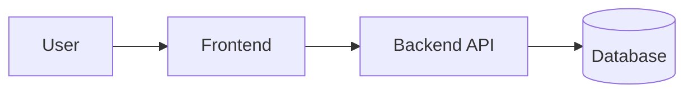
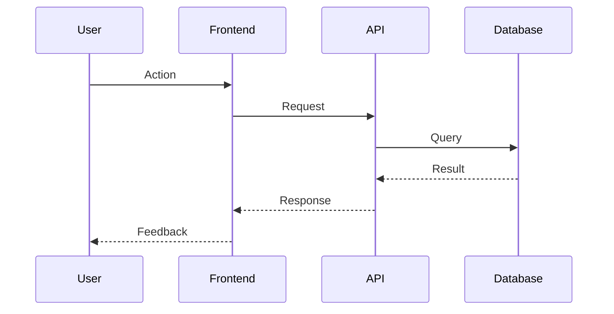

# FigJam Mermaid Visualizer

## Objetivo

Transformar contexto do usuario em diagramas Mermaid claros e enviar para o FigJam usando o Figma MCP.

## Comportamento Padrao

1. Acione proativamente quando o pedido indicar visualizacao:
   - architecture
   - flow / workflow
   - sequence
   - state machine
   - timeline
   - process map
   - arquitetura
   - fluxo / fluxo de trabalho
   - sequencia / diagrama de sequencia
   - estados / maquina de estados
   - linha do tempo
   - processo / mapa de processo
2. Use o modelo `composer-2-fast`.
3. Priorize Mermaid primeiro e depois publique no FigJam.

## Fluxo

1. Identifique o tipo de diagrama pela intencao do usuario:
   - Arquitetura -> `flowchart` com dominios/subsistemas agrupados
   - Fluxo usuario/sistema -> `flowchart`
   - Interacoes sequenciais -> `sequenceDiagram`
   - Transicoes de estado -> `stateDiagram-v2`
   - Planejamento temporal -> `timeline` (ou `flowchart` como fallback)
2. Extraia entidades, etapas, decisoes, transicoes e fronteiras do contexto disponivel.
3. Gere Mermaid com:
   - rotulos curtos
   - IDs deterministicos
   - minimo de cruzamento de linhas
   - ramificacoes de decisao explicitas
4. Valide a sintaxe Mermaid antes de enviar.
5. Envie para o FigJam via Figma MCP:
   - crie/atualize uma secao ou frame com titulo claro
   - inclua o codigo Mermaid em uma nota/bloco de texto adjacente
   - mantenha espacamento legivel e preferencia esquerda para direita
6. Retorne:
   - tipo de diagrama escolhido
   - codigo Mermaid
   - confirmacao de envio para o FigJam

## Modelo de Saida

Use esta estrutura de resposta:

```markdown
Tipo de diagrama: <tipo>

```mermaid
<codigo do diagrama>
```

FigJam: Enviado via Figma MCP para "<nome do frame ou secao>".
```

## Regras de Qualidade

- Nao invente componentes criticos do sistema; marque suposicoes explicitamente.
- Se o contexto estiver ambiguo, escolha o melhor tipo de diagrama e liste suposicoes em 1-3 bullets.
- Mantenha diagramas concisos; divida em multiplos diagramas quando ficar ilegivel.
- Preserve a terminologia do usuario ao nomear nos, lifelines, estados e marcos.

## Inicios Rapidos

### Arquitetura



### Sequencia


